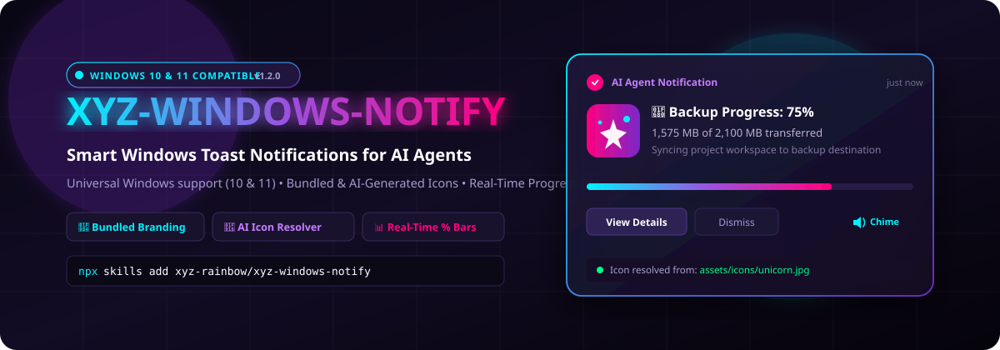
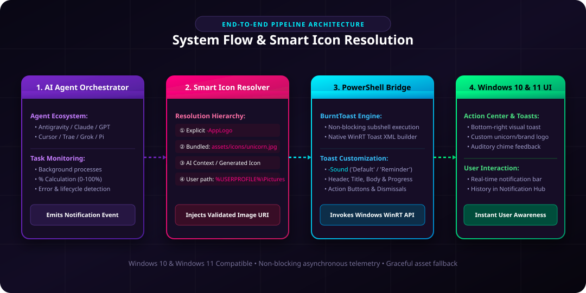
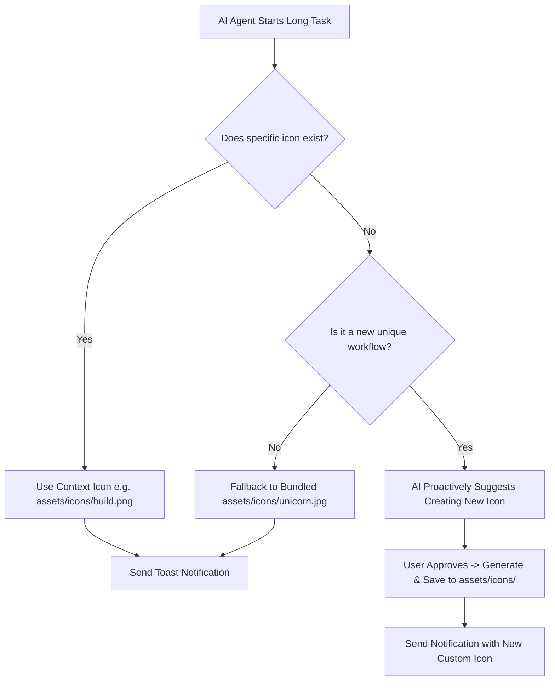

<div align="center">



# 🦄 XYZ Windows Notify

**Universal AI Agent Toast Notification Skill for Windows**

[](LICENSE)
[](https://microsoft.com/powershell)
[](https://microsoft.com/windows)
[](https://skills.sh)
[](#-one-command-installation-skills-cli)
[](https://github.com/Windos/BurntToast)

*Supercharge AI agent workflows with native Windows toast notifications (fully compatible with Windows 10 & 11), percentage progress bars (%), bundled & AI-generated custom app logos (`-AppLogo`), non-blocking background telemetry, and sound alerts.*

</div>

---

## 📸 Visual Architecture & Lifecycle Workflow

### 🏗️ System Architecture & Smart Resolution Pipeline
<div align="center">
  
</div>

<br/>

### 🔄 Notification Lifecycle & Progress Milestones
<div align="center">
  
</div>

---

## ✨ Key Features

- 🦄 **Bundled Default Branding**: Out-of-the-box unicorn logo bundled directly in `assets/icons/unicorn.jpg` and `assets/icons/icon.jpg`.
- 🪟 **Universal Windows Support**: Fully compatible with both **Windows 10** and **Windows 11** via the PowerShell `BurntToast` engine.
- 🤖 **AI-Driven Icon Intelligence**: AI agents can detect workflow domains, select themed icons, or suggest generating custom 256x256 icons.
- 📊 **Real-Time Progress Milestones (%)**: Send non-blocking progress updates at 10%, 25%, 50%, 75%, and 90% milestones.
- 🚀 **Full Lifecycle Coverage**: Start, In-Progress, Success (100%), and Error/Exception toast notifications.
- 🔔 **Windows Action Center Integration**: Native toasts with customizable sound effects (`-Sound 'Default'`, `'Reminder'`, `'Alarm2'`).
- 🌐 **Universal Multi-Agent Standard**: Compatible with Antigravity, Claude, GPT, Cursor, Trae, Pi, Grok, and custom subagents.

---

## 🚀 One-Command Installation (Skills CLI)

Install directly into any AI agent environment using the universal `skills` CLI:

```bash
npx skills add xyz-rainbow/xyz-windows-notify
```

*Or via full repository URL:*
```bash
npx skills add https://github.com/xyz-rainbow/xyz-windows-notify
```

---

## 🎨 Custom Icons & AI Asset Management Guide

### 1. Where to Place Your Custom Logos / Icons

You can add custom icons for your specific projects and workflows:

| Location | Purpose | Example Path |
| :--- | :--- | :--- |
| **`assets/icons/` (Bundled)** | Default branding & themed task icons | `assets/icons/unicorn.jpg`, `assets/icons/deploy.png` |
| **`assets/diagrams/`** | Visual documentation diagrams (SVGs) | `assets/diagrams/banner.svg`, `assets/diagrams/workflow.svg` |
| **User Global Folder** | Personal system-wide icon repository | `%USERPROFILE%\Pictures\Icons\custom.png` |
| **Custom Project Path** | One-off icon path passed directly | `C:\Projects\my-app\assets\logo.png` |

### 2. Recommended Icon Specifications

- **Format**: `PNG` or `JPG` (square 1:1 aspect ratio).
- **Dimensions**: `256x256` or `512x512` pixels.
- **Visuals**: Clean, high-contrast imagery with transparent or dark-mode friendly background.

---

### 3. AI Agent Protocol: Auto-Selection & Proactive Generation

When an AI agent executes tasks with this skill, it follows this automated decision tree:



#### How AI Agents Proactively Suggest New Icons:
When an agent detects a distinct recurring workflow (such as a database migration, build pipeline, or data sync), it will suggest:
> *"I noticed we don't have a dedicated notification icon for **Database Sync**. Would you like me to generate a custom 256x256 icon and save it to `assets/icons/database.png` for future toasts?"*

---

## ⚙️ Prerequisites & Setup

### Install PowerShell BurntToast Module
Run in PowerShell (Current User or Administrator):

```powershell
Install-Module BurntToast -Scope CurrentUser -Force -AllowClobber
```

Verify your installation:
```powershell
Import-Module BurntToast
New-BurntToastNotification -Text "BurntToast OK", "Notifications configured successfully!"
```

---

## 💻 Code Snippets & Usage Examples

### 🔹 PowerShell Integration (with Backward-Compatible Resolution)

```powershell
Import-Module BurntToast

# Smart Icon Resolution (icons/ -> legacy root -> user folder)
$Candidates = @(
    "$PSScriptRoot\assets\icons\unicorn.jpg",
    "$PSScriptRoot\assets\unicorn.jpg",
    "$env:USERPROFILE\Pictures\Icons\custom.png"
)

$AppLogo = $Candidates | Where-Object { Test-Path $_ } | Select-Object -First 1

# Send Toast
if ($AppLogo) {
    New-BurntToastNotification `
        -Text "🦄 Progress: 75%", "1,575 MB of 2,100 MB transferred" `
        -AppLogo $AppLogo `
        -Sound 'Default'
} else {
    New-BurntToastNotification `
        -Text "📊 Progress: 75%", "1,575 MB of 2,100 MB transferred" `
        -Sound 'Default'
}
```

---

### 🔹 Python Integration Wrapper

```python
import subprocess
import os

def send_toast(title: str, message: str, icon_path: str = None, sound: str = "Default"):
    """
    Sends a native Windows toast notification (Windows 10 & 11) with automatic icon resolution.
    """
    base_dir = os.path.dirname(__file__)
    user_icon = os.path.expanduser("~/Pictures/Icons/custom.png")
    
    candidates = [
        icon_path,
        os.path.join(base_dir, "assets", "icons", "unicorn.jpg"),
        os.path.join(base_dir, "assets", "unicorn.jpg"),
        user_icon
    ]
    
    selected_icon = next((c for c in candidates if c and os.path.exists(c)), None)
    
    if selected_icon:
        ps_cmd = f"Import-Module BurntToast; New-BurntToastNotification -Text '{title}', '{message}' -AppLogo '{selected_icon}' -Sound '{sound}'"
    else:
        ps_cmd = f"Import-Module BurntToast; New-BurntToastNotification -Text '{title}', '{message}' -Sound '{sound}'"
        
    subprocess.run(["powershell", "-NoProfile", "-ExecutionPolicy", "Bypass", "-Command", ps_cmd], capture_output=True)

# Example: Task Lifecycle Monitoring
if __name__ == "__main__":
    send_toast("🚀 Task Started", "Beginning backup of project workspace...")
    send_toast("📊 Progress: 50%", "Transferred 1,024 MB / 2,048 MB")
    send_toast("✅ Task Complete (100%)", "2,100 files successfully verified and stored!")
```

---

## 🌐 Multi-Agent Directory Reference

To distribute this skill across different AI agent environments on Windows:

| Agent Environment | Destination Directory |
| :--- | :--- |
| **Global Agent Skills** | `C:\Users\<user>\.agents\skills\windows-notify\` |
| **Google Antigravity / Gemini** | `C:\Users\<user>\.gemini\config\skills\windows-notify\` |
| **Anthropic Claude Code / Desktop** | `C:\Users\<user>\.claude\skills\windows-notify\` |
| **MiniMax Agent** | `C:\Users\<user>\.minimax\skills\windows-notify\` |
| **xAI Grok Agent** | `C:\Users\<user>\.grok\skills\windows-notify\` |
| **Trae IDE / Agent** | `C:\Users\<user>\.trae\skills\windows-notify\` |
| **Qwen Agent** | `C:\Users\<user>\.qwen\skills\windows-notify\` |
| **Pi / Crush Agent** | `C:\Users\<user>\.pi\agent\skills\windows-notify\` |

---

## 🏷️ Metadata & GitHub Tags

`skills-sh` `npx-skills-add` `windows` `windows10` `windows11` `toast-notifications` `burnttoast` `powershell` `ai-agent-skill` `agent-skills` `notifications`

---

## 📜 License

Distributed under the **MIT License**. See [`LICENSE`](LICENSE) for details.
