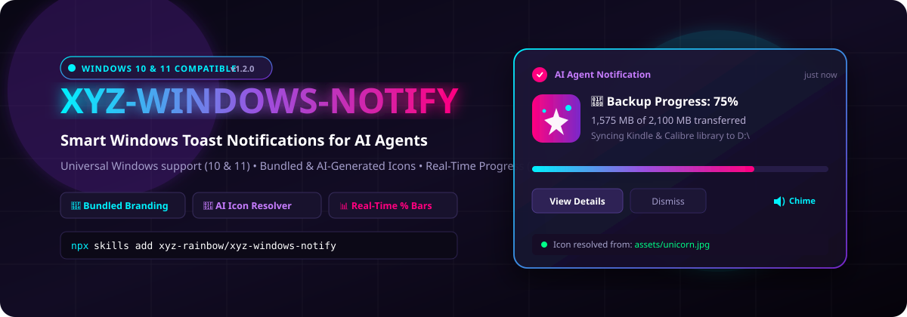
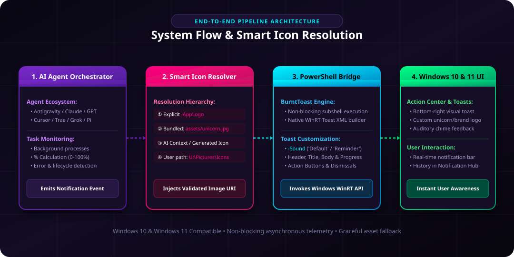
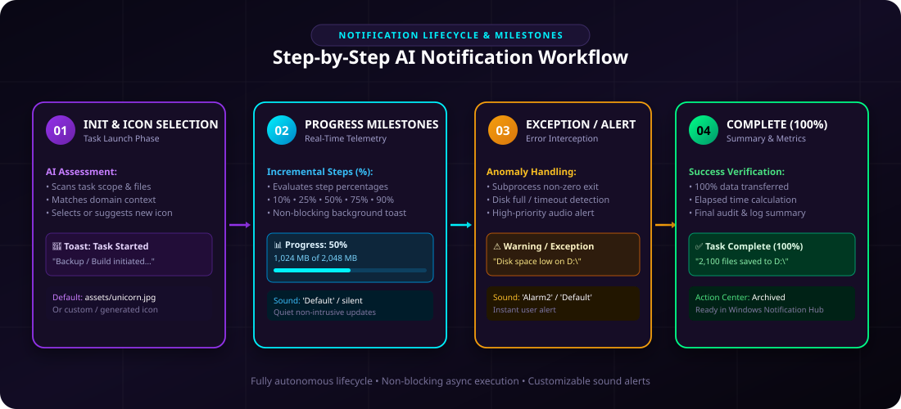

<div align="center">



# 🦄 XYZ Windows Notify

**Universal AI Agent Toast Notification Skill for Windows 11**

[](LICENSE)
[](https://microsoft.com/powershell)
[](https://github.com/Windos/BurntToast)
[](#global-installation-for-ai-agents)

*Elevate your AI agent workflows with native Windows 11 toast notifications, percentage progress bars (%), custom branding icons (`-AppLogo`), and non-blocking background process monitoring.*

</div>

---

## 📸 Visual Architecture & Workflow

### System Architecture


### Notification Lifecycle & Progress Milestones


---

## ✨ Features

- 🦄 **Custom Branding Icons**: Attach custom `-AppLogo` images (e.g. `U:\Pictures\Icons\unicorn.jpg`).
- 📊 **Real-Time Progress (%)**: Send progress updates at 10%, 25%, 50%, 75%, 90% milestones.
- 🚀 **Lifecycle Alerts**: Start, In-Progress, Success (100%), and Error toast notifications.
- 🔔 **Windows Action Center**: Native Windows 11 visual toasts with sound feedback (`-Sound 'Default'`).
- 🤖 **Universal AI Agent Compatibility**: Works out-of-the-box with Antigravity, Claude, GPT-4, Cursor, and custom subagents.

---

## ⚙️ Prerequisites & Setup

### 1. Install PowerShell BurntToast Module
Open PowerShell and run:

```powershell
Install-Module BurntToast -Scope CurrentUser -Force -AllowClobber
```

Verify installation:
```powershell
Import-Module BurntToast
New-BurntToastNotification -Text "BurntToast OK", "Notifications working!"
```

---

## 🌐 Global Installation for AI Agents

To equip any AI Agent (Antigravity, Claude, Cursor, AutoGPT) with this skill globally:

### Step 1: Copy Skill to Global Configuration
Copy the `SKILL.md` file to your AI Agent's global skill folder:

```powershell
# Antigravity / Gemini CLI global skill path
mkdir -p "C:\Users\$env:USERNAME\.gemini\config\skills\windows-notify"
copy "SKILL.md" "C:\Users\$env:USERNAME\.gemini\config\skills\windows-notify\SKILL.md"
```

### Step 2: System Prompt / Skill Directive
Add the following line to your system prompt or rule file:
> *"Always use the `windows-notify` skill via BurntToast for background task progress, backups, builds, and notifications with custom icons (`-AppLogo`)."*

---

## 💻 Code Snippets & Usage Examples

### PowerShell Command

```powershell
Import-Module BurntToast

New-BurntToastNotification `
    -Text "🦄 Backup Progress: 50%", "Copiados 1,024 MB de 2,048 MB" `
    -AppLogo "U:\Pictures\Icons\unicorn.jpg" `
    -Sound 'Default'
```

### Python Script Integration

```python
import subprocess
import os

def notify(title, message, icon=r"U:\Pictures\Icons\unicorn.jpg"):
    ps_cmd = f"Import-Module BurntToast; New-BurntToastNotification -Text '{title}', '{message}' -AppLogo '{icon}' -Sound 'Default'"
    subprocess.run(["powershell", "-NoProfile", "-ExecutionPolicy", "Bypass", "-Command", ps_cmd], capture_output=True)

# Example Usage
notify("🚀 Backup Started", "Copying Kindle L:\\ and Calibre U:\\ to D:\\")
notify("📊 Progress: 70%", "1,450 MB / 2,100 MB transferred")
notify("✅ Backup Complete (100%)", "2,100 files successfully saved!")
```

---

## 🏷️ GitHub Tags & Metadata

`windows11` `toast-notifications` `burnttoast` `powershell` `ai-agent-skill` `antigravity` `notifications` `automation` `unicorn-icon`

---

## 📜 License

Distributed under the MIT License. See `LICENSE` for more information.
